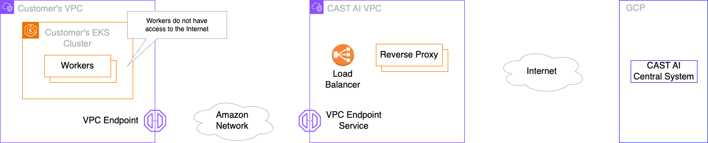

# About This Repository

This repository provides some guidance and other means to help customers using CAST AI PrivateLink capability on AWS.
The following diagram depicts components that implement this capability:

# Prerequisites

CAST AI PrivateLink capability is relevant for cases when a customer uses an EKS cluster and its nodes do not have
access to the Internet. Normally, such a cluster cannot be onboarded with CAST AI, because CAST AI's agents will not
be able to communicate with the central system. CAST AI PrivateLink capability is meant to overcome this limitation
by using [AWS PrivateLink](https://aws.amazon.com/privatelink/) technology.

## VPC

Naturally, there must be a VPC used to host things as subnets, routing table, etc. Moreover, EKS cluster will need to be
hosted in this VPC as well.

### Subnets

Subnets created in a given VPC may be private ones; access to the Internet via NAT or similar is **NOT required**.
However, subnets must be tagged `"cast.ai/routable" = "true"` to let CAST AI system know that these subnets are still able
to communicate with the central system.

### VPC Services

Two VPC endpoints (one for REST API traffic and one for gRPC traffic) must be created in a given VPC to allow access to
the central CAST AI system. Check out provided Terraform code for more details. Here is a list of VPC endpoints' names per
supported region (please contact CAST AI if in doubts):

| Region                              | VPC Endpoint                                                                                                                                                                                                                                                                                                                        |
|-------------------------------------|-------------------------------------------------------------------------------------------------------------------------------------------------------------------------------------------------------------------------------------------------------------------------------------------------------------------------------------|
| US East (N. Virginia) us-east-1     | REST API: `com.amazonaws.vpce.us-east-1.vpce-svc-0f648001d494b9a46`   gRPC for _pod-pinner_: `com.amazonaws.vpce.us-east-1.vpce-svc-05e9e206a737781a7`   API via gRPC: `com.amazonaws.vpce.us-east-1.vpce-svc-00d55140e30124b2f`   Downloading artifacts: `com.amazonaws.vpce.us-east-1.vpce-svc-0b611f59ee5494cc3`    Kvisor: `com.amazonaws.vpce.us-east-1.vpce-svc-03281b4e5730a84b6`   Telemetry: `com.amazonaws.vpce.us-east-1.vpce-svc-0c00cf3bb0688c735`   |
| US East (Ohio) us-east-2            | REST API: `com.amazonaws.vpce.us-east-2.vpce-svc-0504dcd21f12037fe`   gRPC for _pod-pinner_: `com.amazonaws.vpce.us-east-2.vpce-svc-0681d838ee3b5e496`   API via gRPC: `com.amazonaws.vpce.us-east-2.vpce-svc-0678ed50f02956c7f`   Downloading artifacts: `com.amazonaws.vpce.us-east-2.vpce-svc-0d1fad36f0230d84c`    Kvisor: `com.amazonaws.vpce.us-east-2.vpce-svc-0a1da2d5a6fd29f32`   Telemetry: `com.amazonaws.vpce.us-east-2.vpce-svc-0bbbaa8913160adfb`   |
| Asia Pacific (Mumbai) ap-south-1    | REST API: `com.amazonaws.vpce.ap-south-1.vpce-svc-07c813d8840493bcf`   gRPC for _pod-pinner_: `com.amazonaws.vpce.ap-south-1.vpce-svc-028ad7f3e7879c47c`   API via gRPC: `com.amazonaws.vpce.ap-south-1.vpce-svc-0dd30c956893d640e`   Downloading artifacts: `com.amazonaws.vpce.ap-south-1.vpce-svc-0c4777e1cc92bf8a8`   Kvisor: `com.amazonaws.vpce.ap-south-1.vpce-svc-07a5d4fcc4dda21e5`   Telemetry: `com.amazonaws.vpce.ap-south-1.vpce-svc-035536415724599aa` |
| Asia Pacific (Hyderabad) ap-south-2 | REST API: `com.amazonaws.vpce.ap-south-2.vpce-svc-0a2a5307bb44fab88`   gRPC for _pod-pinner_: `com.amazonaws.vpce.ap-south-2.vpce-svc-00d1d87c025531c96`   API via gRPC: `com.amazonaws.vpce.ap-south-2.vpce-svc-009c9d91819071294`   Downloading artifacts: `com.amazonaws.vpce.ap-south-2.vpce-svc-05b723b65a7f5a0f9`   Kvisor: `com.amazonaws.vpce.ap-south-2.vpce-svc-097740fd9404cde49`   Telemetry: `com.amazonaws.vpce.ap-south-2.vpce-svc-0e31392ceacc29f9d` |

## EKS Cluster

As mentioned, EKS cluster may be fully isolated from the Internet by placing its nodes in private subnets without access to
the Internet. The only requirement is that it must be accessible (either directly or via bastion) for management purposes
by tools like `kubectl`.

## ECR Registry

Considering EKS cluster isolation from the Internet, CAST AI images still must be provided using alternative means, for
example, by using a private AWS ECR. In such a case, all required CAST AI images must be copied to that private ECR that
nodes have access to (a dedicated script is being developed). Moreover, upgrading agents involves customer's work considering
that CAST AI will not have access to private ECR.

# Onboarding

Onboarding to CAST AI platform can be performed as usual by applying scripts generated by CAST AI console.
However, after applying a script it is important to change deployment image in `castai-agent` namespace.
This is required as nodes do not have access to the public CAST AI repositories (due to cluster being isolated from the Internet).
